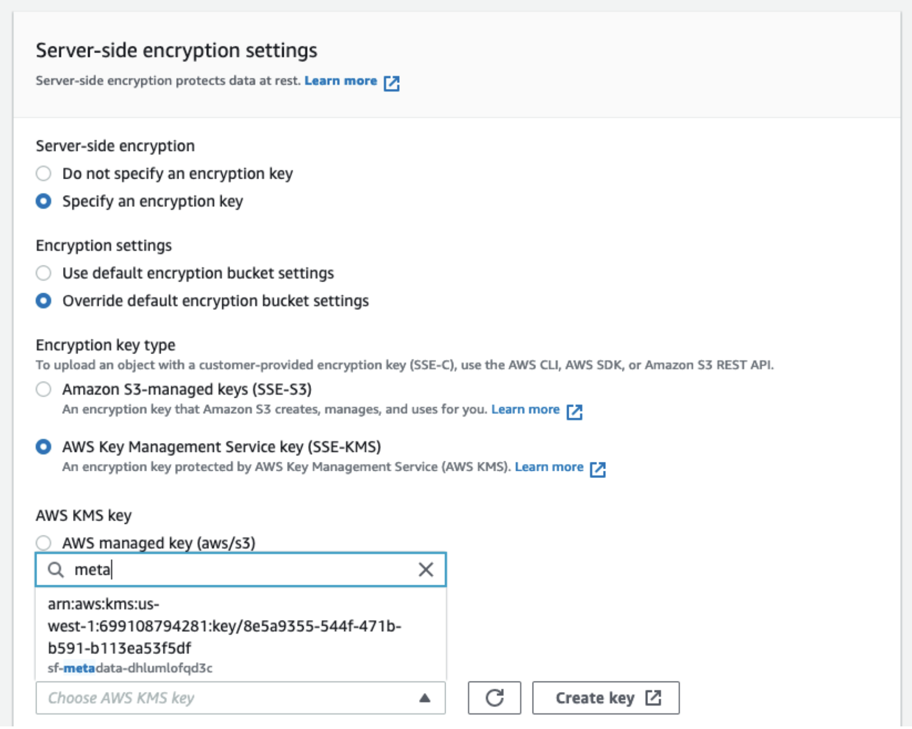
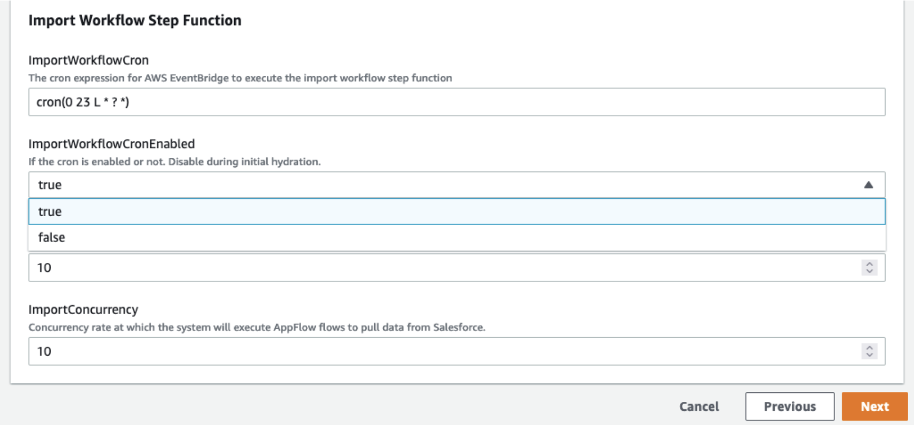

# Advanced Topics

This part includes more advanced topics and is for more technical people.

## Unsupported Fields

Due to complexity of some objects, there are some fields that we do not support. The objects with these types of fields would not be imported. The list of unsupported fields are as below.

- "address"
- "calculated"
- "complexvalue"
- "datacategorygroupreference"
- "junctionidlist"
- "location",
- "masterrecord"
- "byte"

## How to edit objects and fields - post deployment

The system writes `.schema.json` files to a bucket in S3. In order to change the objects and/or fields the system should import, changing these files is required. This task is a bit technical and as so may be difficult for some users to accomplish. Improper formatting or syntax errors will result in complete system failure.

### Adding/Removing Fields in an Existing Object

For a Salesforce Object which is already being imported to the system, to add or remove a field you must download the corresponding file in S3.

- Visit the AWS S3 console, and in the `sf-metadata-<installationId>` bucket, under the `schemas` folder will be all the files.
- Find the one that starts with the Salesforce Object name you intend to edit and download the file.
- In an editor of your choice, move fields within the JSON file to/from the `excluded` and `properties` top level fields.

  Fields in the `excluded` will not be imported, and fields in the `properties` will be imported.

  `Warning:` If you simply remove the field, it will get repopulated into the properties field so this does not work and so must be copied into the exclude section.

- Once complete, upload the file back to S3 with the same name.

The next time the step function runs to sync the data, your changes will be applied.

### Adding/Removing Salesforce Objects

To add a Salesforce Object you need to write a new `.schema.json` file and upload it to the `sf-metadata-<installationId>` bucket under the schemas folder.

It is important that is is named `<SalesforceObjectName>.<installationId>.schema.json` with `SalesforceObjectName` being the name of the object (such as Account, or Opportunity, etc.) and `installationId` being the installation ID for the system.

Other files will be similarly named. Removing an Object is done by deleting the file from the S3 bucket. To add a file, fill out the JSON file with the following structure:

```json
{
  "name": "NameOfObjectInSalesforce",
  "installationId": "abcd1234",
  "type": "object",
  "label": "Label of Object in Salesforce",
  "exclude": {
    "FieldName": {
      "type": "string",
      "label": "Field Name",
      "$comment": "Field Name"
    }
    // ... Any other fields you do not want
  },
  "properties": {
    "ImportedField": {
      "type": "string",
      "label": "Imported Field",
      "$comment": "Imported Field"
    }
    // ... All remaining fields you do want imported
  }
}
```

It is important to note that any fields missing from the properties section which are not explicitly part of the exclude will be automatically added to the properties section. Therefore, to add all fields except the ones in the exclude section, just leave the properties section blank like: `"properties": {}` and the system will fill in the missing properties. To upload the file, see the section called `Uploading the Schema File`.

The next time the step function runs to sync the data, your changes will be applied. To do this manually, see the section called `Manually Applying the Changes`.

### Uploading the Schema File

Visit the AWS S3 console and find the `sf-metadata-<installationId>` bucket and click on it. Go into the `schemas` folder and click `Upload`.

Click `Add files` to add the file you wish to upload. Below, expand the `Properties` section by clicking on it. You will have to specify to override to use the encryption key for that bucket, search for the key named metadata for your installation ID (see screenshot below). Click `Upload` and wait for the upload to be completed.



### Manually Applying the Changes

First, the automated step function execution must be disabled so that two step functions are not running simultaneously.

Visit the AWS CloudFormation console and click on the stack named `sforg-stepfn-<installationId>`. Then click the `Update` button. Click `Next` to use the current template.

At the bottom, find the parameter named `ImportWorkflowCronEnabled` and change the value in the dropdown to false (see screenshot below). Click `Next` two times, check the box that says `I acknowledge ...` and click `Update` stack.

Once completed and the stack status is `UPDATE_COMPLETE`, move to the next step.



With the step function disabled, visit the AWS Step Functions console and click on the step function named `sf_import_<installationId>`. Ensure the list of `Executions` does not have a status of `Running` anywhere on the page.

Then, click the `Start execution` button and when the dialog appears click `Start execution` again (no input is necessary).

When the step function completes, the sync is done. Remember to enable the automated step function execution by going back to CloudFormation and reversing the above steps to change `ImportWorkflowCronEnabled` back to true so that the step function will still run on its regularly scheduled time.
